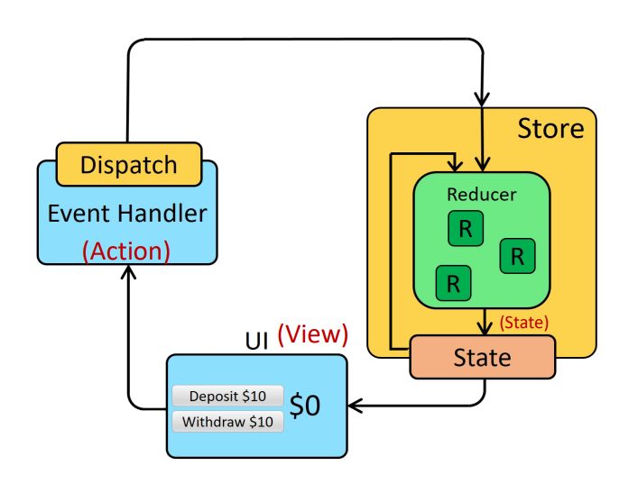
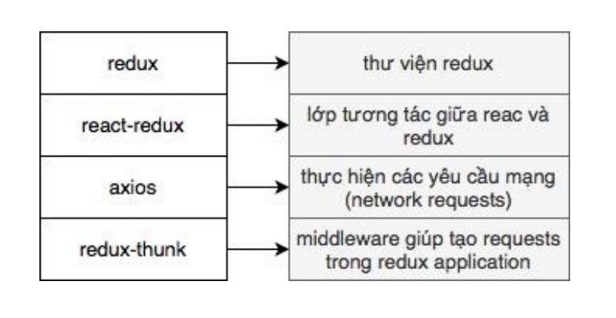
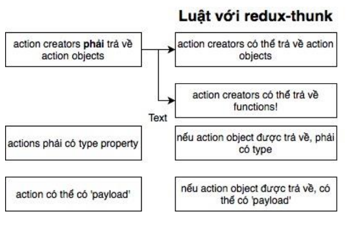

1. Redux là thư viện js quản lý state
- Sử dụng kiến trucd uni-directional data flow
- Giúp tạo các ứng dụng phức tạp dễ dàng hơn
- Không được thiết kế chi tiết để làm việc với React

    - View: mô tả giao diện người dùng dựa vào state hiện tại
    - Action: sựu kiện xảy ra trong ứn dụng dựa vào user input
        + Action như 1 event mô tả điều gì đó xảy ra trong ứng dụng
        + Là 1 javascript obj, có thêm trường type
    - Reducers:
        + như là 1 event listener xử lý các event dựa vào received action (event) type
        + là 1 function, nhận current state và action object, cập nhật state nếu cần và trả về state mới (state,action)=>new state
        + Chỉ nên tính toán giá trị của new state dựa vào đối số state và action
        + Không được phép sửa đổi state hiện có
    - Store
        + Được tạo ra bằng cách truyền vào reducer
        + Dùng phương thức getState để trả về current state.
    - Dispatch
        + Là method của redux store
        + Cách duy nhất để cập nhật state:store.dispatch()

2. React-Redux
- Provider:
    + là componet của react
    + Được cung cấp bởi thư viện react-redux
    + cung cấp store cho những componet con của nó
- Connect():
    + là 1 method
    + kết nối ccas componet đến store
    + cho phép truy xuất global state vào component
    + chỉ có những component bên trong providers mới có thể connect
    + mapStateToProps (state, [ownProps]) => stateProps : được sử dụng để lấy giá trị state (vào component hiện tại) như 1 props value.
    + mapDispatchToProps: được sử dụng để truy xuất dispatch

